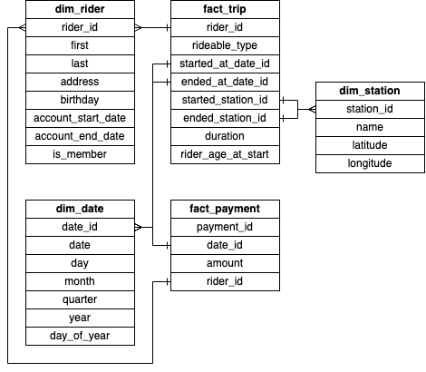

 

  

  <h1 align="center">Udacity course: Data lakes and Lakehouses with Spark and Azure Databricks</h1>

  

    Submission for Udacity course Data lakes and Lakehouses with Spark and Azure Databricks
  

## About The Project

The aim of this project is to solve the project for the Udacity course Data lakes and Lakehouses with Spark and Azure.

### Built With

- [PySpark](https://spark.apache.org/)

## Star Schema

## Contact

florian.schwanz@gmail.com
